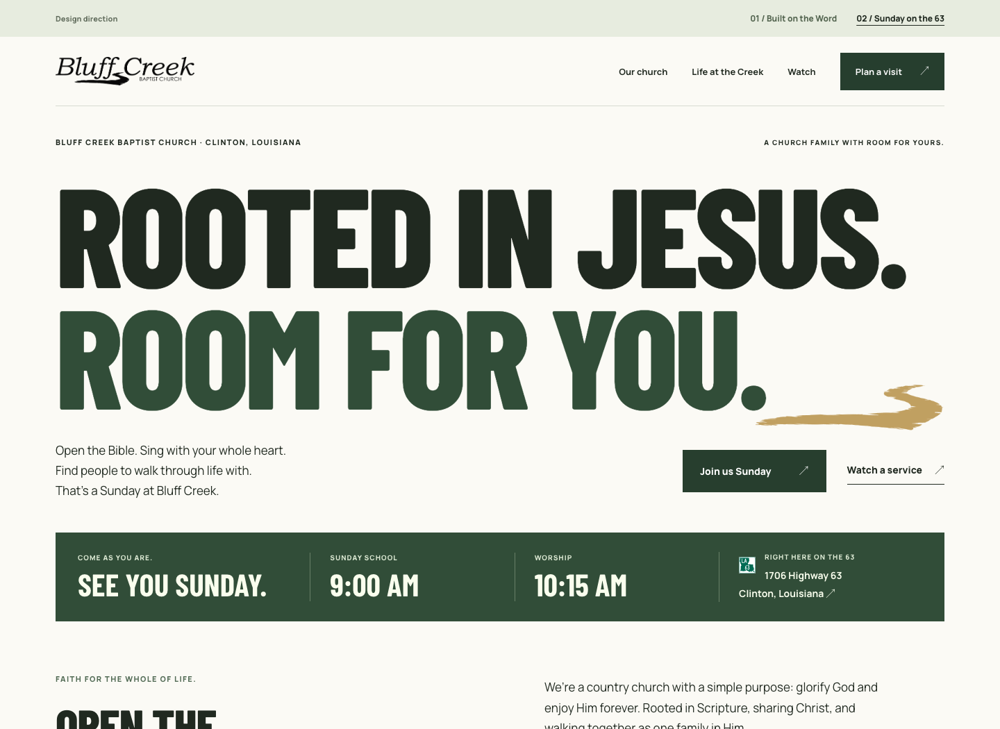
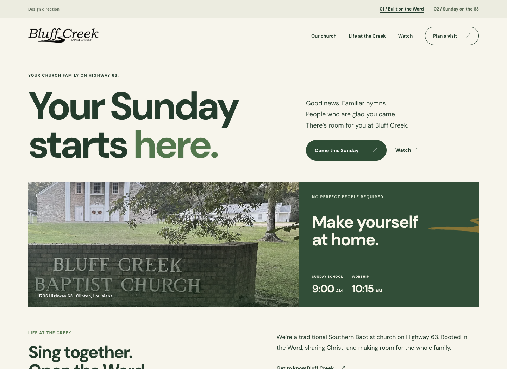

# Homepage direction studies

Two alternatives explore a stronger contemporary church presence while retaining Bluff Creek’s original wordmark and creek. These are opening-page studies; neither replaces the generated public website yet.

## 01 — Built on the Word

Barlow Condensed headlines, Manrope body text, a single broad composition, and an immediate Sunday invitation. The opening leads with “Rooted in Jesus. Room for you.” Photography is not needed to carry the design.

## 02 — Sunday on the 63

DM Sans, a warmer welcome, and the existing sign/building photograph. The place and Sunday invitation form one section, with familiar church life described immediately below.

## Preview

Run `python3 tools/design_directions.py --output /tmp/bcbc-directions` and serve that output directory locally. Open `bold.html` or `warm.html`; the top links switch directions. Each study embeds its existing images and loads its fonts from Google Fonts. Product navigation targets the existing local website on port 8792.

Both studies were checked at 1440, 520, and 320 pixels. The existing church photograph is unchanged; neither direction adds people, field-ministry imagery, or private data. No public website build, account, or DNS change is involved in these studies.
