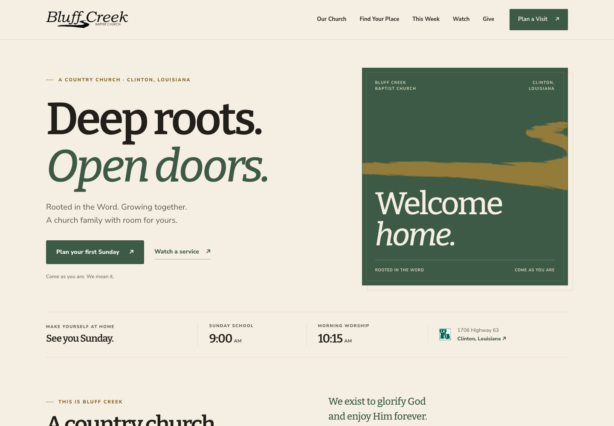

# Homestead — editorial edition

A proposed evolution of Bluff Creek Baptist Church’s existing identity, prepared for review on `codex/homestead-editorial`. The public website is the first application. The existing wordmark, original creek brushstroke, ministry names, and Louisiana 63 marker are preserved.

[Phone homepage preview](previews/home-phone.png)

## The idea

**Deep roots. Open doors.** A country church with a confident, welcoming presence. Scripture and the church family carry the message. Spacious type, warm paper colors, restrained gold, and the actual creek mark carry the design.

Use “Rooted in the Word. Growing together.” as supporting copy. “Welcome home.” is a welcome, not a membership requirement. Keep the established theological and ministry descriptions intact.

## The visual system

| Role | Value | Use |
| --- | --- | --- |
| Ivory | `#F5EFE3` | Main ground; leave generous open space |
| Pine | `#3C5A45` | Primary buttons, headings, occasional feature panel |
| Wheat | `#B08636` | Original creek and decorative accents |
| Dark gold | `#826021` | Small gold text on ivory or white |
| Ink | `#221F1A` | Body and display text |
| Soft ink | `#5E574C` | Supporting copy |
| White | `#FFFFFF` | Forms and supporting surfaces |
| Moss / Creek blue / Clay | `#6B8F5E` / `#557A82` / `#A8573E` | Ministry accents, borders, and occasional details |
| Sign green | `#006B54` | Existing official Louisiana 63 marker only |

**Bitter 600** leads with generous size and tight tracking. **Bitter 500 italic** adds one warm phrase. **Nunito Sans** handles body, labels, navigation, and forms. Body text remains comfortably readable; small uppercase text is reserved for short labels.

Use the supplied wordmark at its original proportions, black on ivory or reversed on pine. The script belongs to the wordmark only. Use the existing gold creek PNG, never a substitute line. Keep highway markers small, by addresses. Avoid shadows, rounded pills, texture overlays, competing logos, and photo-dependent headlines.

## A ministry family

`[Ministry] @ the Creek` uses the same type and gold creek underline. Ministry accent changes the supporting border, not the wordmark. **Kidz** always uses the z. Youth uses creek blue; Kidz uses moss; Missions uses clay. No separate mascots or new ministry logos.

## Photography

Use a photograph when it answers a question: where to turn, who someone will meet, what the church is actually like. The homepage uses the existing sign photograph for wayfinding; About uses existing staff portraits. Photographs recede through subtle desaturation and pine overlays.

No new identifiable people, minors, or field-ministry photographs are introduced. Original files remain untouched. Responsive derivatives strip metadata and do not enlarge small source images. Future photography should come from the church with publication permission, not generic worship stock images.

## Consistency beyond the website

- **Weekly update:** one clear Bitter title, the date, a short opening paragraph, then service times and three upcoming items. Use the same pine action button and link wording as the website.
- **Social graphics:** generous ivory or pine ground, one headline, one original creek, and one useful action. Put the date and location on event posts; keep essential details out of tiny captions.
- **Sunday slides and stream:** the same wordmark, Bitter heading, Nunito Sans supporting type, and gold creek. Use approved service titles; do not invent sermon series artwork or speakers.
- **Policies and forms:** ivory cover, black wordmark, pine headings, clear owner/version/date fields. Document body pages should favor white backgrounds and legible black text.
- **Staff signatures:** church name, role, approved church contact, website. Keep the mark small and the message readable without images.
- **Creek Office:** apply the same tokens and typography when the separate admin portal is reviewed. This website PR does not activate its authentication or storage.

These are reuse directions, not changes to accounts, live templates, or canonical church records.

## Maintaining the website

Edit page content in `build.py`, shared structure in `css/site.css`, and the editorial design in `css/polish.css`. Run `python3 build.py`; do not edit generated HTML. The normal build needs only Python’s standard library.

The calendar continues to read the app-owned `events.json`. Keep its verified dated occurrences current; this design does not invent future dates or connect the Google approvals CSV. When dates expire, visitors get the weekly meeting schedule.

When an approved source photo changes, install Pillow in a local development environment and run `python3 tools/image_pipeline.py`. Commit the generated manifest and derivatives along with the source change. `image_helpers.py` emits responsive WebP sources, JPEG fallback, lazy loading, and dimensions.

Share graphics live in `assets/social/`. Run `python3 tools/social_cards.py --output /tmp/bcbc-share-cards` to create their self-contained HTML sources, then capture each in a browser at exactly 1200 × 630 after fonts load. These are occasional asset exports, separate from the normal build.

Run `python3 -m unittest discover -s tests` and `node --test tests/events.test.cjs`. Check the pages at desktop and phone widths before opening a PR. No merge, deployment, DNS, or account action is part of this design proposal.
